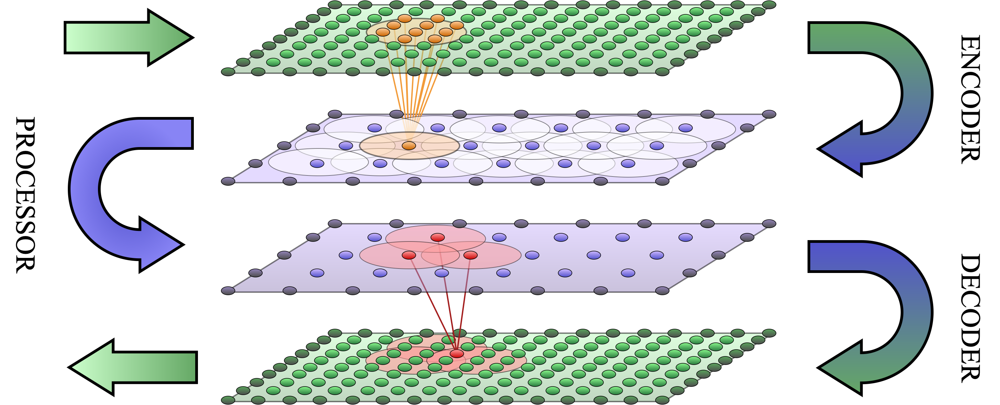
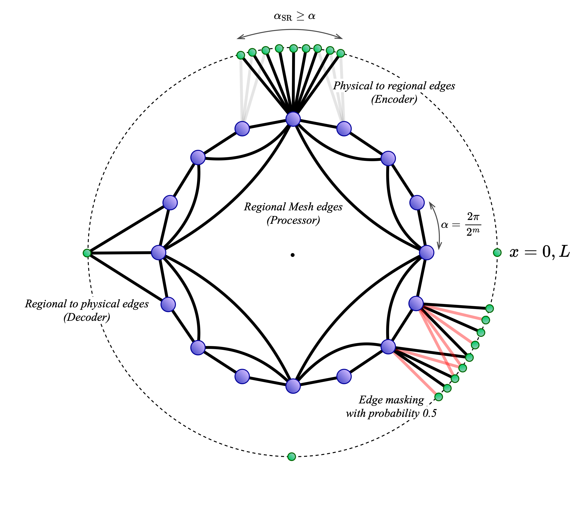
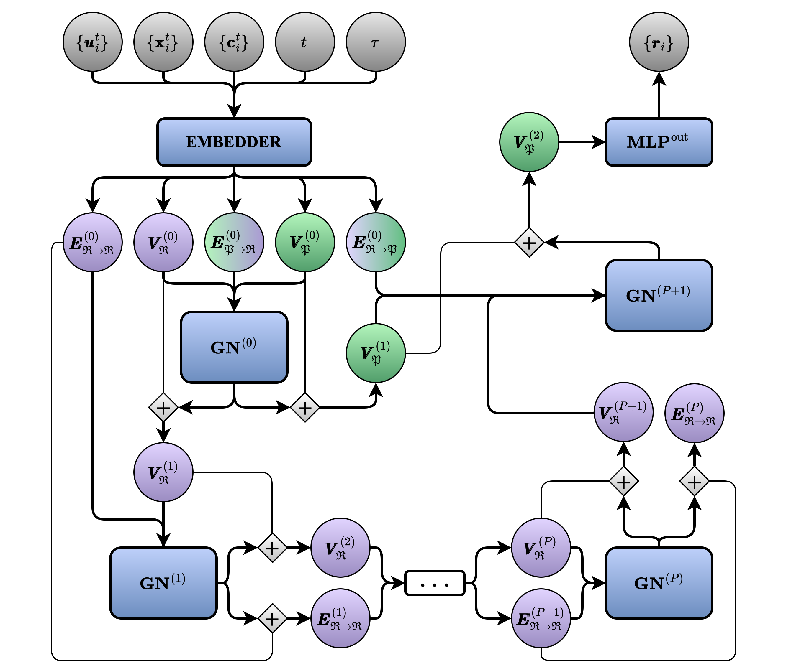

# RIGNO: Region Interaction Graph Neural Operator

RIGNO is a graph neural network architecture for operator learning that is discretization invariant, easily
adaptable to unstructured meshes, and robust to input noise.
Focusing on time-dependent partial differential equations, we utilize training techniques with temporal solution
trajectories to impose continuity in time, which allows trained operators to effectively perform time interpolation
and time extrapolation without compromising accuracy.

The main message-passing happens in the space of a low-resolution
mesh with nodes that each represent a sub-region of the domain, and
only interact with each other.
The following figure draws a schematic of how the information is
transmitted from the original mesh to the regional mesh and vice-versa.
<p align="center">  </p>

Complex boundary conditions can easily be imposed to the structure
of the graphs via cross-boundary edges or node types.
Here is a schematic of the graph structure used in RIGNO for a 1D problem with periodic boundary conditions.
<p align="center">  </p>

The following flowchart summarizes the message passing in a single
pass of a RIGNO.
<p align="center">  </p>

The following figure illustrates the estimates produced by a RIGNO with 2.7 million parameters trained on 1024 solution trajectories
of the incompressible Navier-Stokes equations in a two-dimensional
square domain with periodic boundary conditions. The time difference
between the input and the output is 0.7s.

<p align="center">  </p>


## Setup

Build and activate the environment (Check [JAX compatibility](https://jax.readthedocs.io/en/latest/installation.html) first):
```bash
python -m virtualenv venv
source venv/bin/activate
pip install -r requirements.txt
```

Train a model with default settings:
```bash
python -m rigno.train --datadir 'path_to_data' --datapath 'relative_path_to_dataset' --epochs 20 --batch_size 2 --n_train 128 --n_valid 128
```

### ETH Euler cluster
Steps for setting up the environment on the Euler cluster:

```bash
module purge
module load stack/.2024-05-silent gcc/13.2.0 python/3.11.6_cuda
cd ~/venvs
python -m pip install --user virtualenv
python -m virtualenv venv-NAME
source venv-NAME/bin/activate
pip install --upgrade pip
pip install --upgrade "jax[cuda12]"
pip install flax matplotlib h5py optax pandas seaborn
```
